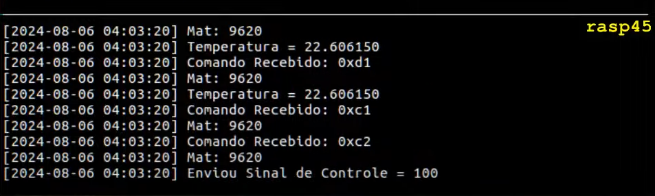
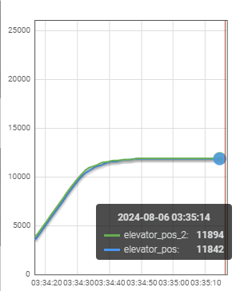
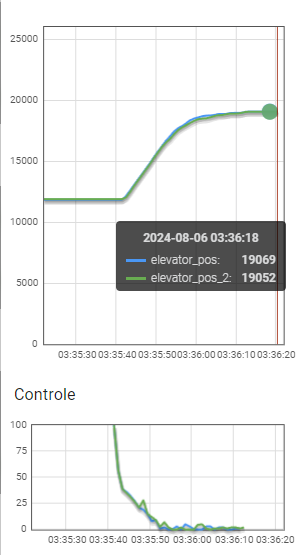
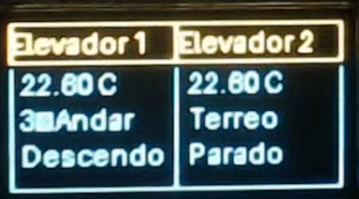

# Trabalho 2 (2024-1)

Trabalho 2 da disciplina de Fundamentos de Sistemas Embarcados (2024/1). Focado no desenvolvimento do software que efetua o controle completo de um sistema de elevadores prediais, sendo composto por:

* 02 Elevadores controlados pelos motores e monitorados por sensores;
* 04 Sensores de posição dos andares para cada elevador;
* 02 Sensores BMP280 (I2C) para a medição da temperatura interna de cada elevador;
* 01 módulo Display OLED 0.96" 128x64 SSD1306 com circuito I2C integrado;
* 01 Conversor lógico bidirecional (3.3V / 5V);
* 01 Driver de potência para acionamento dos motores;
* 01 ESP32;
* 01 Raspberry Pi 4.

Mais informações estão disponíveis no [Enunciado do trabalho](https://gitlab.com/fse_fga/trabalhos-2024_1/trabalho-2-2024-1).

## Estrutura do Projeto

O projeto está estruturado em quatro grandes módulos: **gpio**, **i2c**, **uart**, e **setup**. O primeiro contém o código para controle de GPIOs dos elevadores, o segundo lida com a comunicação I2C, o terceiro gerencia a comunicação UART, e o último contém as configurações do sistema. Mais detalhes da estrutura podem ser vistos na árvore de diretórios abaixo:

```
├── assets ---> Imagens do projeto.
├── README.md ---> Documentação do repositório.
├── gpio ---> Módulo para controle de GPIOs dos elevadores.
│   ├── elevator.py ---> Controle do movimento do elevador e sensores associados.
│   ├── elevator_controller.py ---> Gerenciamento e lógica de controle dos elevadores.
│   ├── engine.py ---> Controle do motor do elevador.
│   └── pid.py ---> Implementação do algoritmo PID para controle de movimento.
├── i2c ---> Módulo para comunicação I2C.
│   ├── oled_screen.py ---> Controle da tela OLED para exibição de informações.
│   └── temp_sensors_controller.py ---> Controle dos sensores de temperatura.
├── main.py ---> Script principal para iniciar a aplicação.
├── requirements.txt ---> Dependências da aplicação.
├── reset_all.py ---> Script para resetar as configurações e estados das GPIOs.
├── setup ---> Configurações do sistema.
│   └── config.json ---> Arquivo de configuração com parâmetros das GPIOs.
└── uart ---> Módulo para comunicação UART.
    ├── crc_utils.py ---> Utilitários para cálculo de CRC.
    ├── modbus_controller.py ---> Controle de comunicação Modbus via UART.
    └── uart.py ---> Implementação da comunicação UART.
```

### Módulo GPIO

- [elevator.py](gpio/elevator.py): Controle do movimento do elevador e sensores associados, incluindo a movimentação para diferentes andares.
- [elevator_controller.py](gpio/elevator_controller.py): Gerenciamento e lógica de controle dos elevadores, incluindo a fila de chamadas e a decisão de qual elevador deve atender uma chamada.
- [engine.py](gpio/engine.py): Controle específico do motor do elevador, incluindo as funções de subir, descer e parar.
- [pid.py](gpio/pid.py): Implementação do algoritmo PID para controle preciso do movimento do elevador.

### Módulo I2C

- [oled_screen.py](i2c/oled_screen.py): Gerencia a comunicação com a tela OLED para exibir informações como temperatura, andar atual e estado do elevador.
- [temp_sensors_controller.py](i2c/temp_sensors_controller.py): Controle e leitura dos sensores de temperatura conectados via I2C, monitorando a temperatura dos elevadores.

### Módulo UART

- [crc_utils.py](uart/crc_utils.py): Utilitários para cálculo e verificação de CRC (Cyclic Redundancy Check) utilizado em comunicação.
- [modbus_controller.py](uart/modbus_controller.py): Controle da comunicação Modbus através de UART para interagir com a ESP32.
- [uart.py](uart/uart.py): Implementação da comunicação UART, incluindo a configuração, envio e recebimento de dados.

### Configurações

- [config.json](setup/config.json): Arquivo de configuração das GPIOs.

### Outros Arquivos

- [main.py](main.py): Script principal para iniciar a aplicação.
- [requirements.txt](requirements.txt): Dependências da aplicação.
- [reset_all.py](reset_all.py): Script para resetar as configurações e estados das GPIOs.
- [README.md](README.md): Documentação do repositório.

## Screenshots

Abaixo seguem alguns prints do projeto com suas respectivas descrições:

<br>
A Figura abaixo mostra o feedback da UART na live, especificamente em um momento em que foram enviados os comandos de envio de temperatura, solicitação do valor do encoder e envio de sinal de controle PWM.
 


<br>
A Figura abaixo mostra o gráfico de posição dos elevadores estabilizando ao sair do 1º andar e ir para o 2º, graças ao controle PID.



<br>
A Figura abaixo mostra o gráfico de posição dos elevadores estabilizando ao sair do 2º andar e ir para o 3º. Assim como o comportamento do sinal de controle do PID nesse mesmo período.



<br>
A Figura abaixo mostra o display OLED de uma das placas durante a execução do projeto. Nela é possível verificar o número do elevador, temperatura, andar atual e estado. (A placa em questão estava com defeito em um dos sensores de temperatura, por isso do valor duplicado).



## Como rodar o projeto

1. Instale as dependências do projeto, executando na raiz do repositório o comando:
    ```
    pip install -r requirements.txt
    ```

2. Configure os pinos da GPIO no [arquivo de configuração](setup/config.json).

3. Inicie a aplicação executando o script principal:
    ```
    python3 main.py
    ```

## Vídeo de Apresentação

[Link para o vídeo da apresentação no youtube](https://youtu.be/2bkz0NbTJ6o)
